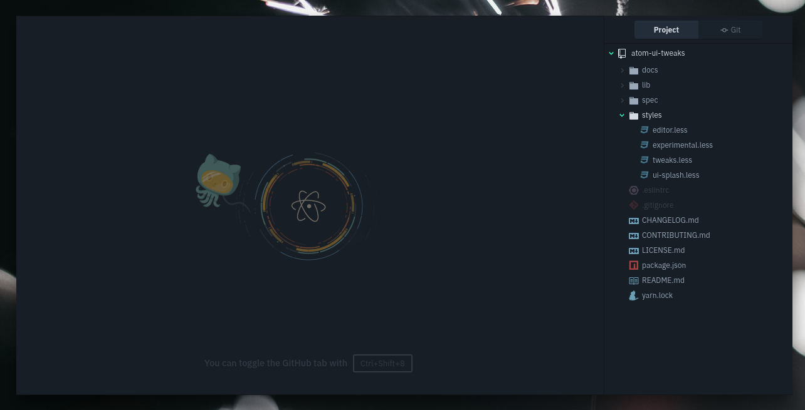
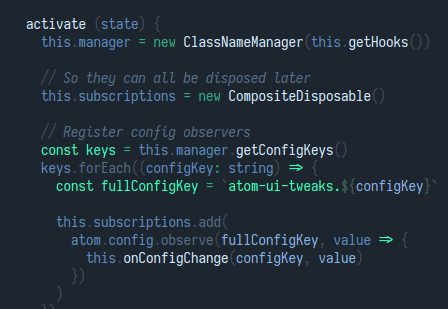

## [v0.2.0]

> Jul 23, 2018

### :nail_care: New tweaks

These new pretty tweaks have been added:

- **UI: Atom logo splash screen** &mdash; makes your no-editor view pretty.

  > 

- **Editor: Cursor line style** &mdash; disable the highlight on the current line, or restyle how it looks like.

  > 

- **Modal: Simplify backdrop** &mdash; fade the editor out when a modal is open.

- **Modal: Disable animation** &mdash; remove the fade-in animation of modal dialog overlays.

- **Editor: Comment font style** &mdash; force italic comments, regardless of syntax theme.

### :sparkles: New features

- Some tweaks are marked as _recommended_ in the settings page. These are my favorite tweaks that I think you'll enjoy.

- Tweaks introduced in this version are marked as _new_ in the settings page.

[v0.2.0]: https://github.com/rstacruz/atom-ui-tweaks/compare/v0.1.0...v0.2.0

## [v0.1.0]

> Jul 18, 2018

- Initial release.

[v0.1.0]: https://github.com/rstacruz/atom-ui-tweaks/tree/v0.1.0
