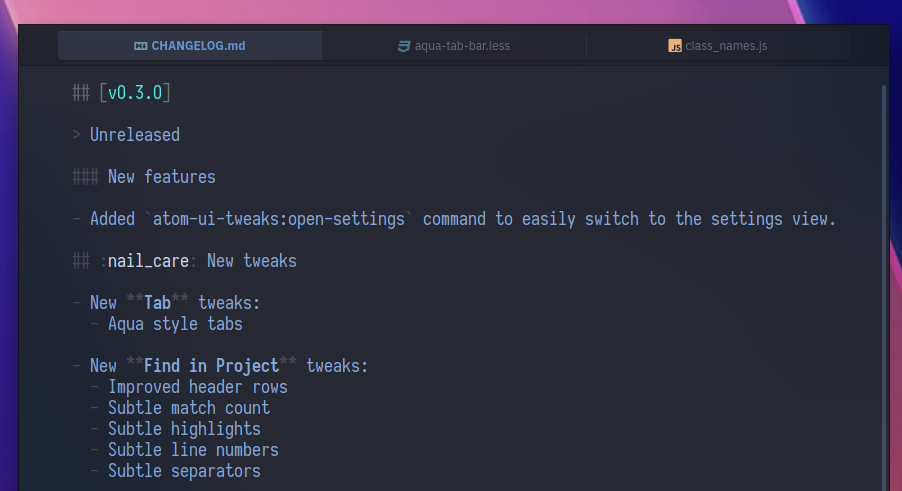
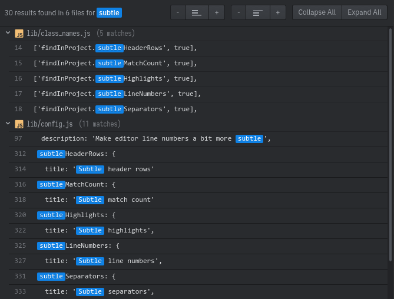
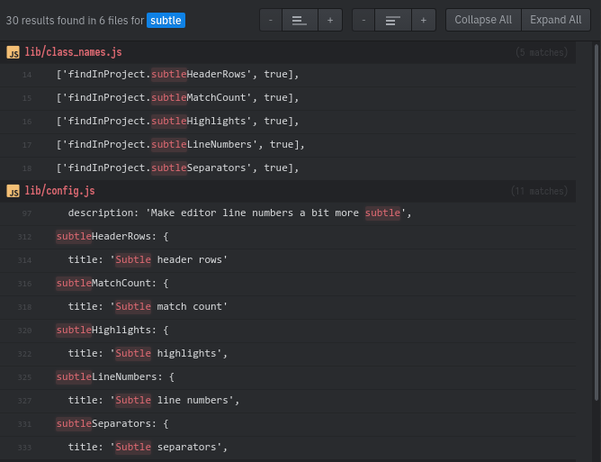

<br>

<p align='center'></p>

<br>

<h1 align='center'>atom-ui-tweaks</h1>

<p align='center'>Prettify your Atom editor with these tweaks that <br> make Atom look sleek and minimal. 💅</p>

<br>

## Installation

Install [atom-ui-tweaks] via apm, or Atom's package settings.

[atom-ui-tweaks]: http://atom.io/packages/atom-ui-tweaks

```bash
apm install atom-ui-tweaks
```

Or Settings ➔ Packages ➔ Search for `atom-ui-tweaks`.

## Screenshots

**atom-ui-tweaks** provides a plethora of tweaks in its settings page. Here's an example:

<blockquote>

<details>
<summary>More screenshots</summary>
<br>
<br>

</details>
</blockquote>

:sparkles: **Atom logo splash screen** _(below)_ updates the look of the app when no editors are open. _(New in v0.2.0)_

> 

:point_right: **Cursor line style** _(below)_ allows you to restyle the highlight on the current line. Shown here is \_brighten_: a more subtle way of highlighting than changing the background. _(New in v0.2.0)_

> 

:nail*care: **Tab bar style** *(below)_ lets you restyle the tab bar differently. _(New in v0.3.0)\_

> 

:mag: **Find in Project** _(below)_ tweaks will make the find in project dialog more readable. _(New in v0.3.0)_

> 

:hash: **Small line numbers** _(below)_ tweak makes line numbers less prominent, but highlighting the fold points. **Simplified indent guides** will only show indent guides for the blocks that the cursor is in.

> 

:tophat: **Status on top** _(below)_ moves the statusbar on top. (Also shown: _Increase status bar padding_, _Bold filename_, _Fake traffic lights_)

> 

:dizzy: **Compact fuzzy finder** _(below)_ shows more lines in the Ctrl+P dialog by reducing each item to a single line.

> 

:ghost: **Terminal: stealth toolbar** _(below)_ makes the terminal toolbar blend in with the rest of the terminal, making terminals feel more integrated into Atom. (Also shown: _hide insert text button_)

> 

Here are screenshots with titlebars from the Vimix GTK theme (some extra CSS tweaks to make them integrate better):

> 

## Thanks

**atom-ui-tweaks** © 2018+, Rico Sta. Cruz. Released under the [MIT] License.<br>
Authored and maintained by Rico Sta. Cruz with help from contributors ([list][contributors]).

> [ricostacruz.com](http://ricostacruz.com) &nbsp;&middot;&nbsp;
> GitHub [@rstacruz](https://github.com/rstacruz) &nbsp;&middot;&nbsp;
> Twitter [@rstacruz](https://twitter.com/rstacruz)

[](https://github.com/rstacruz) &nbsp;
[](https://twitter.com/rstacruz)

[mit]: http://mit-license.org/
[contributors]: http://github.com/rstacruz/atom-ui-tweaks/contributors
