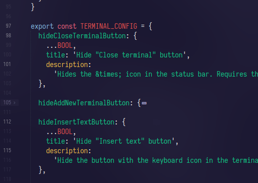
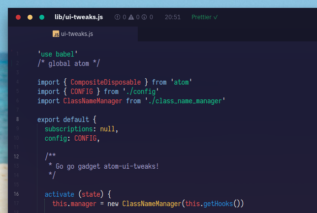
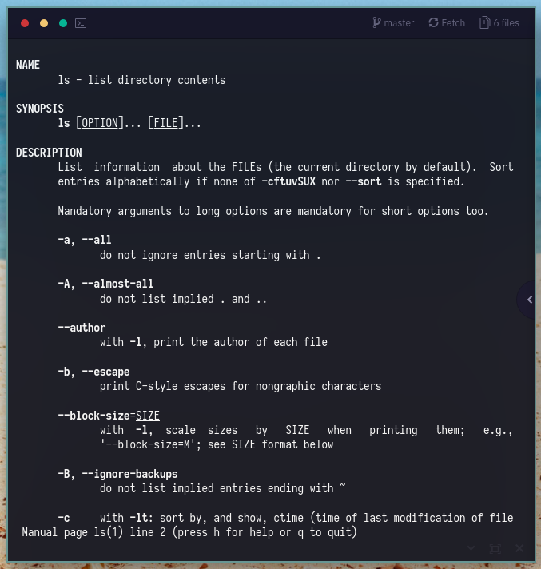

# atom-ui-tweaks

> Various tweaks for Atom editor

A grab-bag collection of tweaks to make your Atom editor look more sleek and minimal. :heart:

## Installation

```bash
apm install rstacruz/atom-ui-tweaks
```

## Examples

**Small line numbers** _(below)_ tweak makes line numbers less prominent, but highlighting the fold points. **Simplified indent guides** will only show indent guides for the blocks that the cursor is in.



**Status on top** _(below)_ moves the statusbar on top. (Also shown: _Increase status bar padding_, _Bold filename_, _Fake traffic lights_)



**Compact fuzzy finder** _(below)_ shows more lines in the Ctrl+P dialog by reducing each item to a single line.


**Terminal: stealth toolbar** _(below)_ makes the terminal toolbar blend in with the rest of the terminal, making terminals feel more integrated into Atom. (Also shown: _hide insert text button_)


