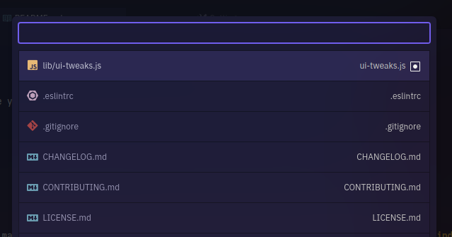

# atom-ui-tweaks

> Prettify your Atom editor UI with these sleek tweaks

Pimp your Atom editor with these tweaks that make Atom look more sleek and minimal. :heart:

## Installation

Install [atom-ui-tweaks](http://atom.io/packages/atom-ui-tweaks) via apm, or Atom's package settings.

```bash
apm install atom-ui-tweaks
```

## Screenshots

>  <br>  <br>  <br> 

## Examples

**Small line numbers** _(below)_ tweak makes line numbers less prominent, but highlighting the fold points. **Simplified indent guides** will only show indent guides for the blocks that the cursor is in.


**Status on top** _(below)_ moves the statusbar on top. (Also shown: _Increase status bar padding_, _Bold filename_, _Fake traffic lights_)


**Compact fuzzy finder** _(below)_ shows more lines in the Ctrl+P dialog by reducing each item to a single line.



**Terminal: stealth toolbar** _(below)_ makes the terminal toolbar blend in with the rest of the terminal, making terminals feel more integrated into Atom. (Also shown: _hide insert text button_)


Here are screenshots with titlebars from the Vimix GTK theme (some extra CSS tweaks to make them integrate better):


## Thanks

**atom-ui-tweaks** © 2018+, Rico Sta. Cruz. Released under the [MIT] License.<br>
Authored and maintained by Rico Sta. Cruz with help from contributors ([list][contributors]).

> [ricostacruz.com](http://ricostacruz.com) &nbsp;&middot;&nbsp;
> GitHub [@rstacruz](https://github.com/rstacruz) &nbsp;&middot;&nbsp;
> Twitter [@rstacruz](https://twitter.com/rstacruz)

[](https://github.com/rstacruz) &nbsp;
[](https://twitter.com/rstacruz)

[mit]: http://mit-license.org/
[contributors]: http://github.com/rstacruz/atom-ui-tweaks/contributors
